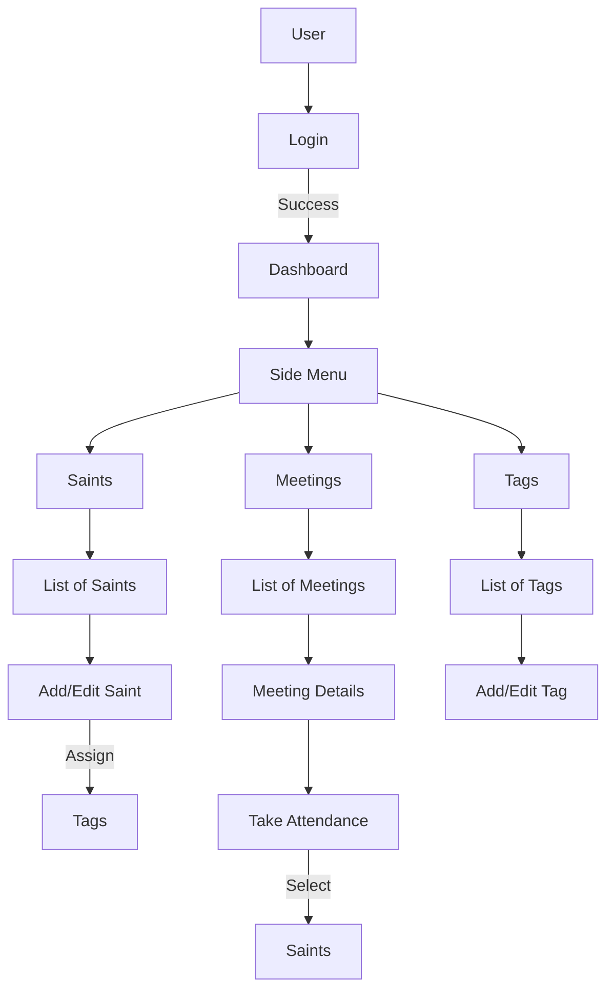

# Church Attendance App - Design Document

## 1. Overview

The Church Attendance App is a mobile application (Android & iOS) designed to help church administrators and members manage attendance tracking. It provides a simple, minimalist interface to manage "Saints" (members), "Tags" (categories), and "Meetings". Users can record attendance for meetings by selecting saints and linking them to specific meetings.

The app will leverage **Supabase** for backend services, including Authentication (Auth) and Database (Postgres), ensuring secure data storage and real-time capabilities if needed. The UI will strictly adhere to standard Flutter Material Design guidelines without third-party UI libraries, ensuring a clean and native feel.

## 2. Goals & Requirements

### Core Goals
*   **Authentication:** Secure user login and registration.
*   **Data Management:** CRUD (Create, Read, Update, Delete) operations for:
    *   **Tags:** Categories for organizing saints or meetings.
    *   **Saints:** Individual profiles (Name, details, tags).
    *   **Meetings:** Event records.
*   **Attendance Tracking:** Associate Saints with Meetings.
*   **Minimalist Design:** Clean, distraction-free UI using standard Flutter widgets.

### Technical Requirements
*   **Framework:** Flutter (Mobile - Android & iOS).
*   **Backend:** Supabase (Auth & Database).
*   **State Management:** Flutter's built-in `ListenableBuilder`, `ValueNotifier`, or `ChangeNotifier` (per `GEMINI.md` guidelines).
*   **Navigation:** `go_router` (per `GEMINI.md` guidelines).
*   **Dependencies:** `supabase_flutter`, `go_router`.

## 3. Architecture & Data Model

### 3.1 Data Model (Supabase/Postgres)

Based on the provided schema, the database will contain the following tables:

*   **`tags`**:
    *   `id` (int8, PK)
    *   `created_at` (timestamptz)
    *   `type` (varchar) - e.g., 'status', 'role'
    *   `name` (varchar) - e.g., 'active', 'student'

*   **`saints`**:
    *   `id` (int8, PK)
    *   `created_at` (timestamptz)
    *   `name` (varchar)
    *   `city` (varchar)
    *   `address` (text)
    *   `phone` (varchar)
    *   `school` (varchar)
    *   `meeting_hall` (varchar)
    *   `birthdate` (timestamp)
    *   `note` (text)

*   **`meetings`**:
    *   `id` (int8, PK)
    *   `created_at` (timestamptz)
    *   `name` (text)
    *   `meeting_date` (timestamp)
    *   `note` (text)

*   **`saints_tags`** (Join Table):
    *   `id` (int8, PK)
    *   `created_at` (timestamptz)
    *   `saints_id` (int8, FK -> saints.id)
    *   `tags_id` (int8, FK -> tags.id)

*   **`meetings_attendance`** (Join Table):
    *   `id` (int8, PK)
    *   `created_at` (timestamptz)
    *   `meetings_id` (int8, FK -> meetings.id)
    *   `saints_id` (int8, FK -> saints.id)

*   **`users` (Supabase Auth)**:
    *   Managed by Supabase Auth. We will assume a `profiles` table might be needed if we store app-specific user data, but for now, we rely on the `auth.users` table for login.

### 3.2 Application Architecture (Layered)

We will follow the **Feature-based Organization** recommended in `GEMINI.md`.

*   **`lib/core/`**: Shared utilities, constants, and the global Supabase client instance.
*   **`lib/features/auth/`**: Login and Registration screens and logic.
*   **`lib/features/dashboard/`**: Main layout with Sidebar (Drawer) navigation.
*   **`lib/features/saints/`**: Saints list, add/edit saint, saint details.
*   **`lib/features/meetings/`**: Meetings list, create meeting, attendance sheet.
*   **`lib/features/tags/`**: Tags management.

### 3.3 State Management Strategy

We will use **ChangeNotifier** with **ListenableBuilder** or **Provider** (if dependency injection is strictly needed, but `GEMINI.md` prefers built-in solutions). A `Repository` pattern will abstract Supabase calls.

*   `AuthRepository`: Handles `Supabase.instance.client.auth` calls.
*   `DataRepository`: Handles `Supabase.instance.client.from('table')` calls.

## 4. UI/UX Design

### Navigation
*   **Authentication Flow:** Login Screen -> (Register Screen) -> Dashboard.
*   **Dashboard:** Uses a `Scaffold` with a `Drawer` for side navigation.
    *   **Side Bar Items:**
        *   Home/Dashboard
        *   Saints (People)
        *   Meetings
        *   Tags
        *   Logout

### Screens
1.  **Login/Register:** Simple form with Email/Password.
2.  **Saints List:** `ListView` of saints. Floating Action Button (FAB) to add new.
3.  **Saint Details/Edit:** Form to edit profile and manage tags (using `saints_tags`).
4.  **Meetings List:** `ListView` of meetings. FAB to create new.
5.  **Meeting Attendance:** A screen for a specific meeting showing a list of all saints with checkboxes (or a multi-select search) to mark attendance.

## 5. Implementation Plan Summary

1.  **Setup:** Initialize Flutter app, add `supabase_flutter`, configure generic Supabase client.
2.  **Auth:** Implement Login/Register flows.
3.  **Core Data:** Create Dart models for all tables.
4.  **Features:**
    *   Implement **Tags** CRUD.
    *   Implement **Saints** CRUD (including tag association).
    *   Implement **Meetings** CRUD.
5.  **Attendance:** Implement the logic to link Saints to Meetings via `meetings_attendance`.
6.  **Refinement:** Polish UI, ensure "Minimalist" aesthetic, code cleanup.

## 6. Diagram

## 7. References
*   [Supabase Flutter Quickstart](https://supabase.com/docs/guides/getting-started/tutorials/with-flutter)
*   [Flutter Material Design](https://flutter.dev/docs/development/ui/material)
